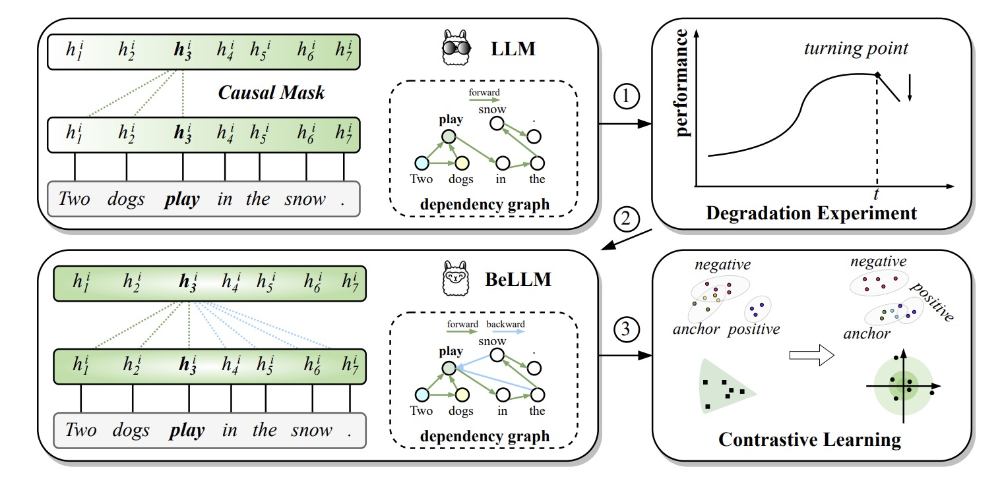

# BeLLM

BeLLM: Backward Dependency Enhanced Large Language Model for Sentence Embeddings (NAACL24)

Arxiv: https://arxiv.org/abs/2311.05296

<p align="center">

</p>

💡 **Highlight**: To the best of our knowledge, **our work is the first to extensively investigate the effects of backward dependencies in autoregressive LLMs architectures for sentence embedding learning**. 

## Pretrained Models:

- [SeanLee97/bellm-llama-7b-nli](https://huggingface.co/SeanLee97/bellm-llama-7b-nli)


## Training


### 1. Installation

`angle_emb` and `billm` are required. You can install them by running the following commands:

```bash
python -m pip install -r requirements.txt
```

### 2. Dataset

We trained our models using MultiNLI and NLI datasets (they can be downloaded from sentence-transformers https://sbert.net/datasets/AllNLI.tsv.gz)

We use the following preprocessing steps to obtain the training set:
- Transform the original format to `{"text": "text", "positive": "positive of text", "negative": "negative of text"}`.
- Augment the negative samples with retrieval and reranking techniques.

We have pushed the processed train set to huggingface:
- [SeanLee97/all_nli_angle_format_b](https://huggingface.co/datasets/SeanLee97/all_nli_angle_format_b)
- [SeanLee97/all_nli_aug_angle_format_b](https://huggingface.co/datasets/SeanLee97/all_nli_aug_angle_format_b)


### 3. Training

1) 

```bash
BiLLM_START_INDEX=31 WANDB_MODE=disabled CUDA_VISIBLE_DEVICES=0,1,2,3 torchrun --nproc_per_node=4 --master_port=1234 train.py \
--train_name_or_path SeanLee97/all_nli_angle_format_b \
--save_dir ckpts/bellm-llama-7b-nli \
--model_name NousResearch/Llama-2-7b-chat-hf \
--prompt_template 'The representative word for sentence {text} is:"' \
--pooling_strategy avg \
--ibn_w 20.0 --cosine_w 0.0 --angle_w 1.0 --learning_rate 2e-4 --maxlen 60 \
--apply_lora 1 --lora_r 64 --lora_alpha 128 --lora_dropout 0.1 \
--is_llm 1 --apply_billm 1 --billm_model_class LlamaForCausalLM \
--push_to_hub 0 \
--logging_steps 5 --save_steps 50 --warmup_steps 80 --batch_size 256 --seed 42 --load_kbit 4 \
--gradient_accumulation_steps 32 --epochs 3 --fp16 1
```

If you want to push the model to HuggingFace automatically, you can add following extra arguments:

```bash
--push_to_hub 1 \
--hub_model_id {YOUR_MODEL_ID} \
--hub_private_repo 1
```

2) continue to finetune on augmented data:

```bash
BiLLM_START_INDEX=31 WANDB_MODE=disabled CUDA_VISIBLE_DEVICES=0,1,2,3 torchrun --nproc_per_node=4 --master_port=1234 train.py \
--train_name_or_path SeanLee97/all_nli_aug_angle_format_b \
--pretrained_lora_path ckpts/bellm-llama-7b-nli \
--save_dir ckpts/bellm-llama-7b-nli-2 \
--model_name NousResearch/Llama-2-7b-hf \
--ibn_w 1.0 --cosine_w 0.0 --angle_w 0.0 --learning_rate 2e-4 --maxlen 60 \
--is_llm 1 --apply_lora 1 --lora_r 32 --lora_alpha 32 --lora_dropout 0.1 \
--push_to_hub 0 \
--save_steps 200 --batch_size 256 --seed 42 --load_kbit 4 --gradient_accumulation_steps 32 --epochs 3 --fp16 1
```


**Tips:**

- Here we only use contrastive learning loss (ibn_w = 1.0, cosine_w = 0.0, angle_w = 0.0). **It is recommended to use AnglE (set `angle_w` > 0) to further improve the performance.**
- `BiLLM_START_INDEX=31` is used to set layers greater than 31 to be bidirectional. Since the LLaMA-7B has 32 layers, thus `BiLLM_START_INDEX=31` will convert the final layer bidirectional.


### 4. Evaluation

1) download senteval datasets

```bash
cd SentEval/data
sh download_dataset.sh
```

2) evaluate on STS benchmark
```bash
BiLLM_START_INDEX=31 CUDA_VISIBLE_DEVICES=0 python eval_sts.py \
--model_name_or_path NousResearch/Llama-2-7b-hf \
--lora_name_or_path SeanLee97/bellm-llama-7b-nli \
--apply_bfloat16 0
```

Results:

```
+-------+-------+-------+-------+-------+--------------+-----------------+-------+
| STS12 | STS13 | STS14 | STS15 | STS16 | STSBenchmark | SICKRelatedness |  Avg. |
+-------+-------+-------+-------+-------+--------------+-----------------+-------+
| 78.36 | 90.88 | 86.28 | 89.89 | 86.59 |    88.89     |      83.17      | 86.29 |
+-------+-------+-------+-------+-------+--------------+-----------------+-------+
```


### 5. Inference

Here, we combine AnglE and BiLLM to infer.

```bash
import os
# set environment variable for BiLLM_START_INDEX before importing the model
os.environ['BiLLM_START_INDEX'] = '31'
os.environ['CUDA_VISIBLE_DEVICES'] = '0'

from scipy import spatial

from model import AnglE


# 1. load model
model = AnglE.from_pretrained('NousResearch/Llama-2-7b-hf', pretrained_lora_path='SeanLee97/bellm-llama-7b-nli').cuda()

# 2. set prompt
model.set_prompt(prompt='The representative word for sentence {text} is:"')

# 3. encode
docs = ['I like apples', 'I like fruit', 'i am hiking.']
vecs = model.encode([{'text': doc} for doc in docs])

print('cos sim (0, 1):', 1 - spatial.distance.cosine(vecs[0], vecs[1]))
print('cos sim (0, 2)', 1 - spatial.distance.cosine(vecs[0], vecs[2]))
print('cos sim (1, 2):', 1 - spatial.distance.cosine(vecs[1], vecs[2]))
```

output

```
cos sim (0, 1): 0.8061720132827759
cos sim (0, 2) 0.2913861870765686
cos sim (1, 2): 0.29943591356277466
```

### 6. Fine-tuning

You can fine-tune the model on your own dataset by specifying `--pretrained_lora_path` to our pre-trained LoRA models.


## Citation:

```bibtex
@inproceedings{li2024bellm,
    title = "BeLLM: Backward Dependency Enhanced Large Language Model for Sentence Embeddings",
    author = "Li, Xianming and Li, Jing",
    booktitle = "Proceedings of the 2024 Conference of the North American Chapter of the Association for Computational Linguistics",
    year = "2024",
    publisher = "Association for Computational Linguistics"
}
```

## 🌐 Friendship Link

Welcome to follow related works:

- AnglE (BeLLM's elder sister 👭): https://arxiv.org/abs/2309.12871
- LS-LLaMA (BeLLM's father 👨🏻): https://arxiv.org/abs/2310.01208
- We are happy to have you here! Feel free to open an issue (title starts with [Friendship Request]) to report the related works.
